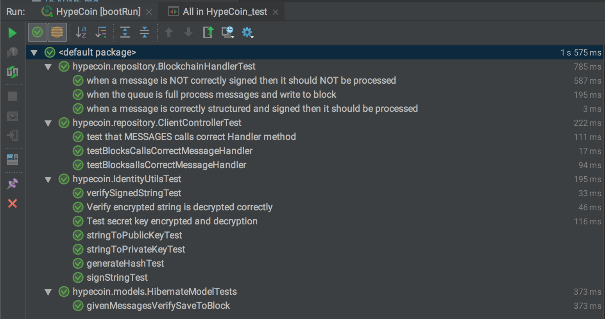

# HypeCoin | Blockchain Basics

This is the source code for the storecoin engineering test, 
see [test details](https://docs.google.com/document/d/1aclamVwp94I80R4aXD5p2pTy5Haf7aua42JeqxMP7VY) for more info.

This project uses Spring Boot as a base. The project is written in Kotlin.

### How to Run
		$ ./gradlew bootRun
		$ gradle bootRun
		$ java -jar HypeCoin.jar
		
Storage uses a H2 RDBMS in-memory database for simplicity. Swapping out the properties in `application.properties` for postgres/mysql would be needed for prod. 

WebSockets are used for a simple p2p model. 
### Notes on Websockets
 Though this example is node <---> client a client to client mesh could be established with the node co-ordinating the initial handshake, a list of sessions exist in the ClientController, peers could be introduced through a broadcast.

WebSockets are notoriously hard to scale but offer huge benefits for realtime applications, if we were applying this to production a queue/loadbalancer approach like the one explained in [this post](https://hackernoon.com/scaling-websockets-9a31497af051) would be needed.

### Queuing
I used a trivial Queue example, but in production Redis/Kafka/RabbitMQ would be used. This would offer redundancy in that OOM/Crashes/Hardware failures could be mitigated by not keeping all the jobs in the nodes memory. A queue would also allow multiple workers to work on the topic/backlog popping jobs off independent of client connections. 

### Encryption
RSA is used to generate a public/private key for the node, and for each client. During the initial handshake the client passes its public key to the node.
The node uses this public key to encrypt an AES secret key, and pass it back to the client. This is a simplified diffie-helman handshake.

The purpose of the AES secret is to mitigate the RSA byte limit, messages are often greater than the 117/254 byte limit that RSA offers, so RSA is only used to encrypt the secret key and to sign messages.

### Test Results
I used mockito to unit test the handlers/controllers in isolation, the use of IOC and dependency injection allowed me to inject mocks and test items in isolation.



### Testing the API
Connect to the web socket using a websocket client, chrome has several good ones like - [this](https://chrome.google.com/webstore/detail/simple-websocket-client/pfdhoblngboilpfeibdedpjgfnlcodoo?hl=en)
Use a url like `ws://localhost:8081/hype/websocket` and a payload like
```
{
   "type": "previous", < Request Type
   "data": "8afc74d2afdf27e1f9fc624a058373b2fa592cb8dbdcab3b93d98542e5701e53" < Sample HASH
}
 ```
 or
```
{
    "type": "blocks",
    "data": ""
}
  ```
where "type" is the type of request - eg register/message/head/previousblock

#### Assumptions
When it came to encryption the spec says:
`The clients encrypt the messages using node’s public key, so only the node can decrypt the message using its private key.`
I assumed this was a mistake or a tripping point, as a message could be N in length, and RSA public/private keys can not encrypt values large than their keys. 
This is why I added AES.

#### Not implemented
I did not implement the Merkle tree bonus point, I was short on time.